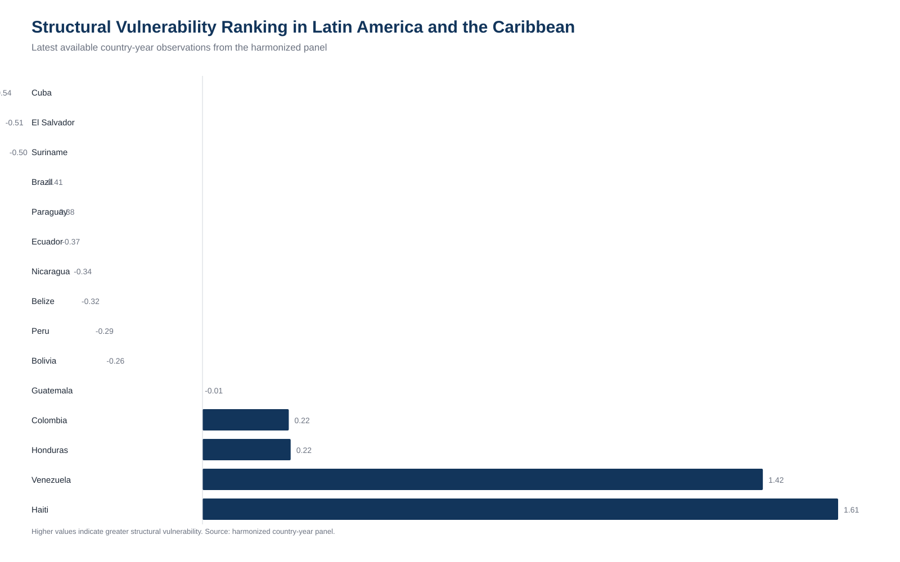
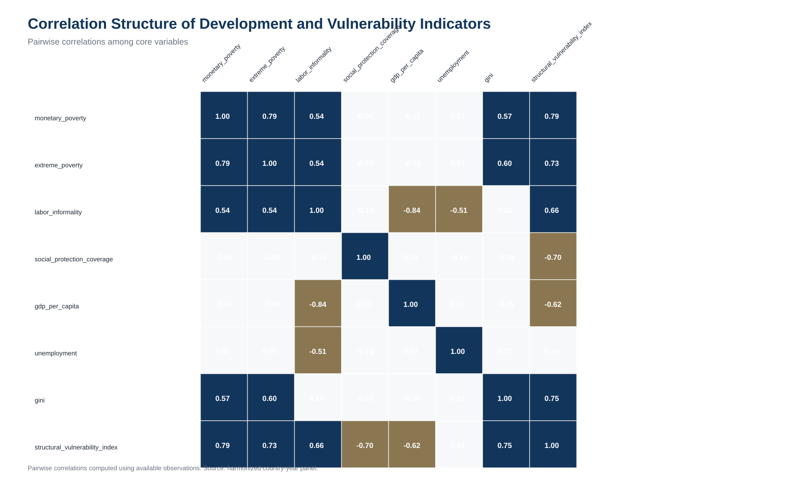
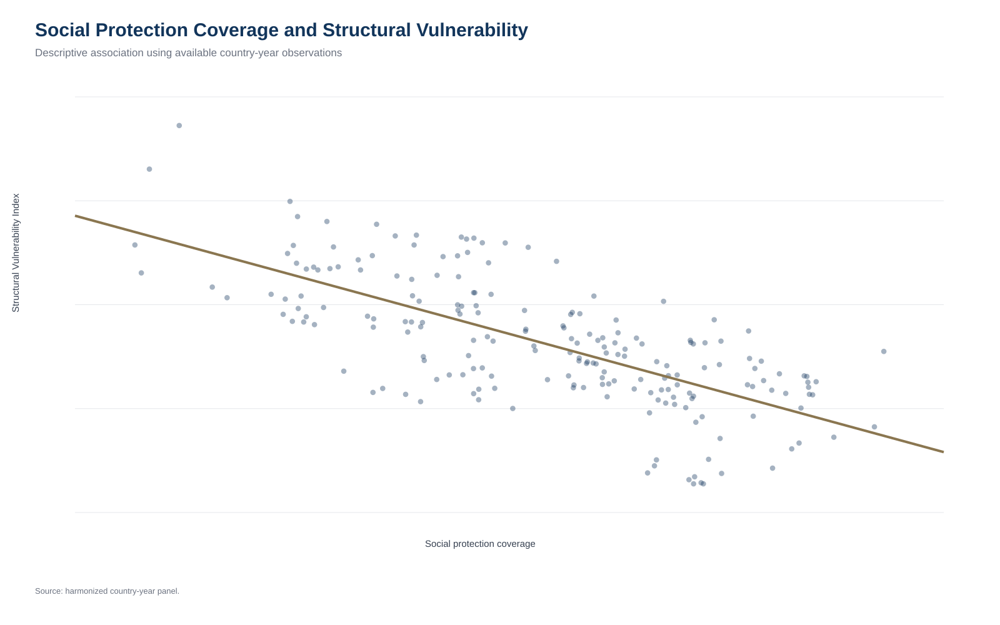

# Structural Vulnerability in Latin America and the Caribbean

Reproducible applied-economics research on poverty, labor informality, social protection and structural vulnerability across Latin America and the Caribbean.


<p align="center">
  
</p>

<p align="center">
  <a href="https://monicact.github.io/structural-vulnerability-lac-research/"></a>
  <a href="https://monicact.github.io/structural-vulnerability-lac-research/dashboard.html"></a>
  <a href="https://monicact.github.io/structural-vulnerability-lac-research/figures.html"></a>
  <a href="https://github.com/MonicaCT/structural-vulnerability-lac-research/tree/main/outputs/models/tables"></a>
  <a href="docs/METHODOLOGY.md"></a>
  <a href="https://github.com/MonicaCT/structural-vulnerability-lac-research"></a>
  <a href="https://monicact.github.io/MonicaCT/"></a>
</p>

## Research Question

How do poverty, labor informality, and social protection jointly shape structural vulnerability across Latin America and the Caribbean?

The repository contains the academic research component of the project: paper materials, empirical framework, model outputs, exploratory data analysis, interpretation files, dashboard pages and reproducibility scripts.

## Why This Matters

Poverty alone does not describe the full exposure of households and economies to development risk. A country may reduce monetary poverty while retaining high labor informality, incomplete social protection, limited macroeconomic capacity and persistent inequality. This project treats structural vulnerability as a multidimensional outcome and documents how those dimensions move together in a transparent regional panel.

## Key Findings

- Labor informality, unemployment and inequality are positively associated with structural vulnerability in the existing panel outputs.
- Social protection coverage and GDP per capita are negatively associated with structural vulnerability.
- Fixed-effects and two-way fixed-effects specifications are preferred for interpretation because they absorb time-invariant country characteristics and common year shocks.
- The evidence is descriptive and associational, not causal.
- Mechanism outputs suggest that social assistance and social insurance expansions are correlated across the region, which limits channel separation in the current panel.
- Country event-study outputs are exploratory and should be interpreted cautiously because policy timing, overlapping reforms and short windows constrain identification.

## Portfolio Classification

Primary lab:

- **Applied Economics Lab** - regional development economics, poverty, informality, social protection and vulnerability.

Secondary labs:

- **Development Analytics Lab** - country-year panel evidence for Latin America and the Caribbean.
- **Research Methods Lab** - reproducible empirical workflow, diagnostics and transparent limitations.
- **Business Intelligence Lab** - public research dashboard and portfolio-facing visual synthesis.
- **Open Science Lab** - auditable code, documented data structure and versioned repository materials.

## Main Figures

| Structural vulnerability ranking | Bolivia profile |
|---|---|
|  |  |

| Regional trends | Correlation heatmap |
|---|---|
|  |  |

| Informality and vulnerability | Social protection and vulnerability |
|---|---|
|  |  |

## Data Coverage

The published dashboard and paper describe the working panel as:

- 648 country-year observations;
- 27 countries;
- 2000-2023 panel years;
- 178 complete-case econometric sample observations;
- 17 countries in the complete-case model sample.

Main variables include poverty, extreme poverty, labor informality, social protection coverage, GDP per capita, unemployment, inequality, gender labor indicators, social expenditure and the structural vulnerability index. The repository documents source families and limitations in the methodology and codebook files.

## Methodology

The empirical framework is associational rather than causal. Country-year panel models document conditional correlations while acknowledging endogeneity, omitted variables, measurement limitations and cross-country heterogeneity.

The first-stage empirical package includes:

- pooled OLS;
- country fixed effects;
- two-way fixed effects;
- clustered standard errors by country;
- descriptive diagnostics and interpretation.

Additional canonical outputs are preserved in `outputs/models/`, including wild cluster bootstrap, Driscoll-Kraay inference, Oster sensitivity, quantile panel results, event-study outputs and mechanism robustness files.

Key documentation:

- [Methodology](docs/METHODOLOGY.md)
- [Empirical strategy](docs/EMPIRICAL_STRATEGY.md)
- [Codebook](docs/CODEBOOK.md)
- [Limitations](docs/LIMITATIONS.md)
- [Model interpretation](MODEL_INTERPRETATION.md)

## Research Site

- [Published research site](https://monicact.github.io/structural-vulnerability-lac-research/)
- [Dashboard](https://monicact.github.io/structural-vulnerability-lac-research/dashboard.html)
- [Figures](https://monicact.github.io/structural-vulnerability-lac-research/figures.html)
- [Paper](https://monicact.github.io/structural-vulnerability-lac-research/paper.html)

The dashboard presents structural vulnerability rankings, Bolivia's profile, regional trends, correlation diagnostics, social-protection and informality scatter plots, model coefficients, observed-versus-predicted diagnostics, missingness and the research pipeline.

## Repository Structure

```text
paper/                  paper sections, appendix, references and draft materials
data/processed/          analysis panels used by the research scripts
docs/                    published site, codebook, methodology and limitations
outputs/eda/             exploratory data analysis tables and figures
outputs/models/          econometric outputs, logs, diagnostics and model tables
outputs/figures/         model-focused figures and dashboard visuals
R/                       R scripts for the research workflow
scripts/                 executable PowerShell and phase scripts
dashboard/               dashboard source materials
```

## Reproducibility

The repository can be reproduced from the included panel files and scripts. The lightweight PowerShell workflow is available for environments without R:

```powershell
powershell -NoProfile -ExecutionPolicy Bypass -File run_all.ps1
```

In an R environment, the script sequence is documented in:

```bash
Rscript run_all.R
```

This README harmonization did not rerun the pipeline, recalculate models or regenerate figures.

## Limitations

The repository is designed for transparent descriptive and econometric research. It should not be read as a causal evaluation of a specific policy. Missingness, source comparability, index construction, country heterogeneity and overlapping policy changes remain central limitations and are documented in the project materials.

## Citation

Citation metadata are available in [CITATION.cff](CITATION.cff).

## Author

**Monica Cueto Tapia**<br>
GitHub: [MonicaCT](https://github.com/MonicaCT)

## Portfolio Navigation

- [MonicaCT GitHub profile](https://github.com/MonicaCT)
- [Economic Complexity and Structural Transformation in Latin America](https://github.com/MonicaCT/economic-complexity-structural-transformation-lac)
- [Inclusive Credit Risk Analytics - Bolivia](https://github.com/MonicaCT/InclusiveCreditRiskAnalytics-Bolivia)
- [Poverty, Informality and Social Protection in Latin America](https://github.com/MonicaCT/poverty-informality-social-protection-lac)
- [Financial Development, Stability and Growth in Latin America](https://github.com/MonicaCT/latin-america-financial-development-lab)
- [Rural Bolivia Housing Analytics](https://github.com/MonicaCT/rural-bolivia-housing-analytics)

## License

This project is released under the [MIT License](LICENSE).