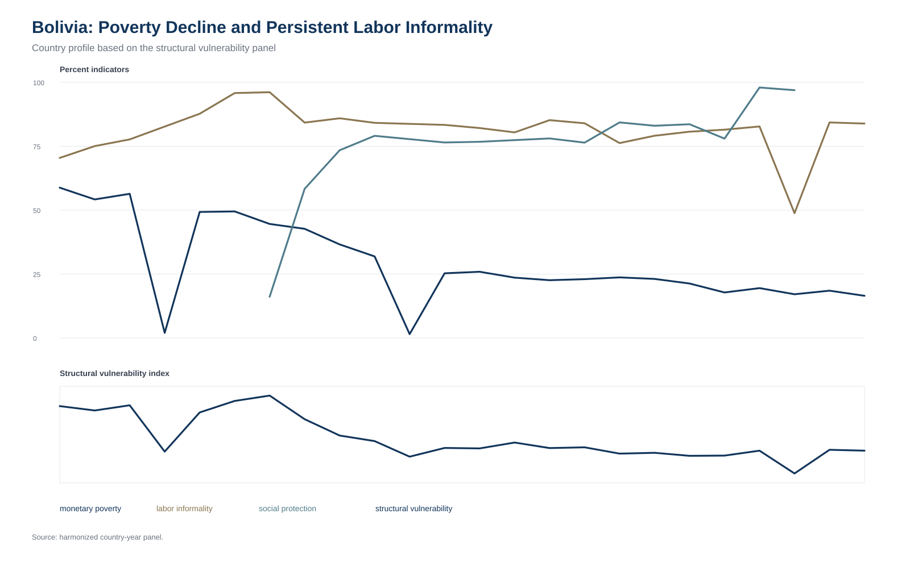
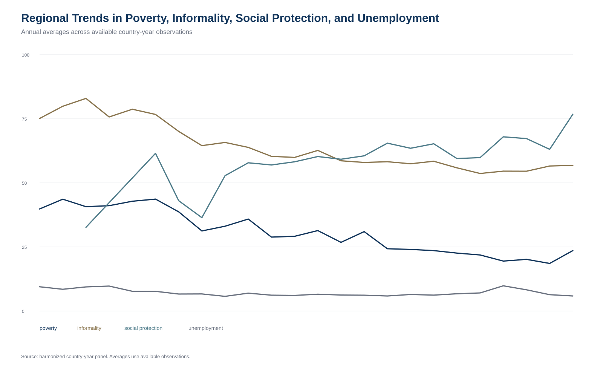
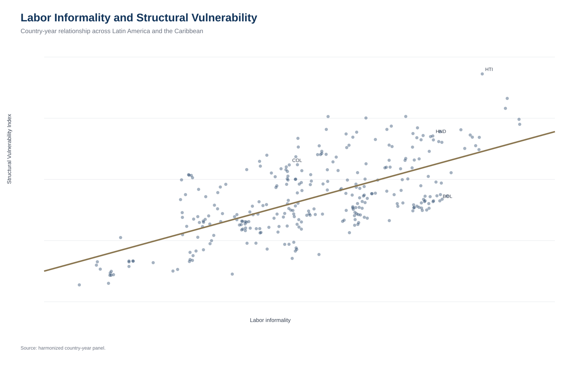
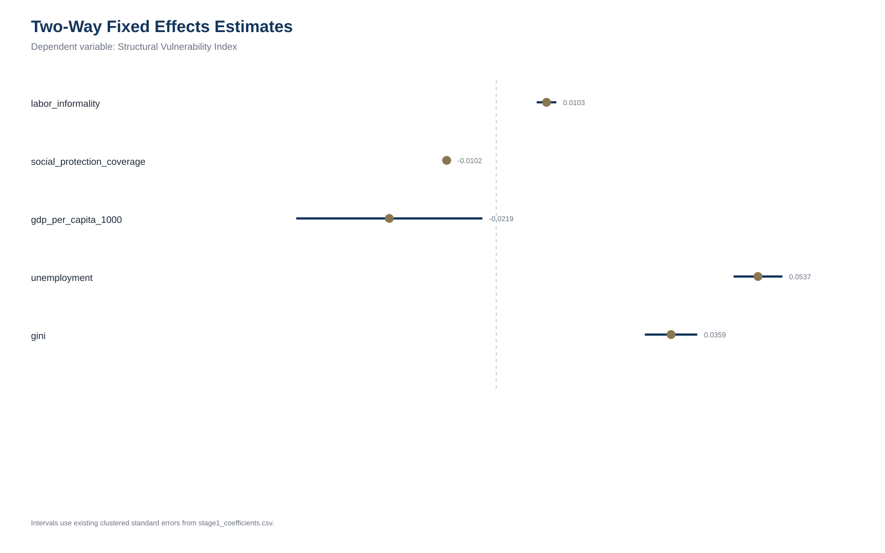
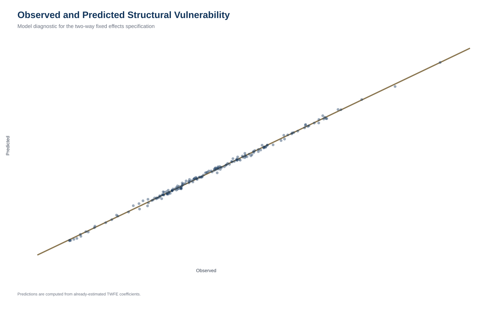
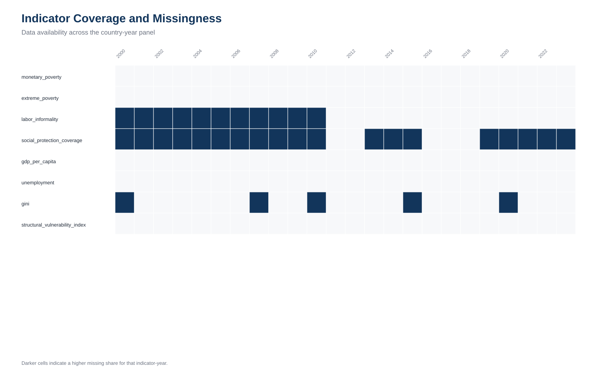
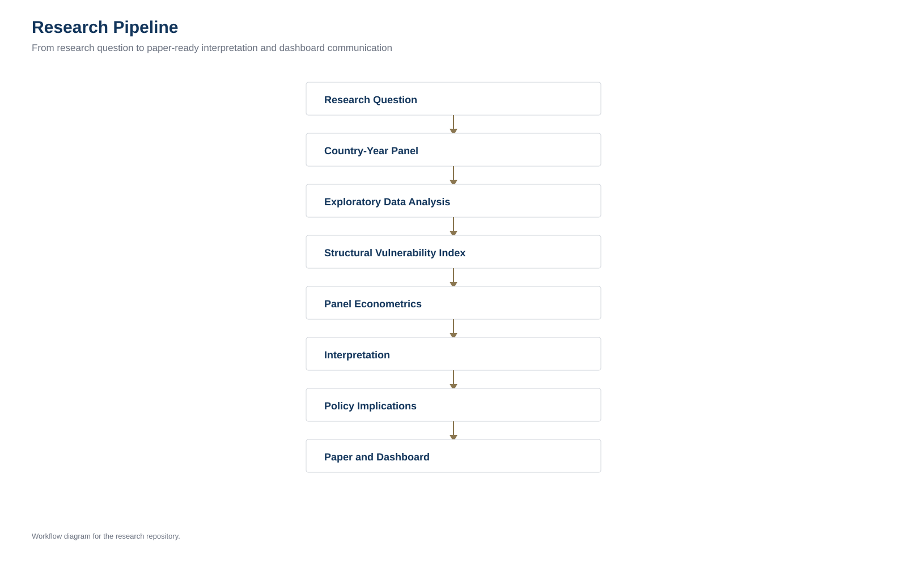

---
title: "Structural Vulnerability in Latin America and the Caribbean"
format:
  html:
    css: styles.css
    toc: true
    toc-depth: 2
    theme: cosmo
    self-contained: false
execute:
  echo: false
---

  
Applied Development Economics Research Dashboard

  <h1>Structural Vulnerability in Latin America and the Caribbean</h1>
  <h2>An OECD-style research dashboard for applied development economics</h2>
  
This dashboard summarizes descriptive and econometric evidence from a harmonized country-year panel covering poverty, labor informality, social protection, macroeconomic conditions, and structural vulnerability in Latin America and the Caribbean.

## Key Indicators

  
27Countries

  
2000-2023Years

  
648Country-year observations

  
178Analytical sample

  
17Countries in econometric sample

  
SVIMain outcome

## Research Question

How do poverty, labor informality, and social protection jointly shape structural vulnerability across Latin America and the Caribbean?

## Main Findings

  
Labor informality is positively associated with structural vulnerability in the TWFE specification.

  
Social protection coverage is negatively associated with structural vulnerability.

  
GDP per capita is negatively associated with vulnerability, while unemployment and inequality are positively associated with vulnerability.

  
Results should be interpreted as associational, not causal, because the index and regressors are conceptually related and endogeneity remains possible.

## Structural Vulnerability Ranking

{.dashboard-figure}

The ranking identifies countries where multiple dimensions of vulnerability overlap.

## Bolivia Country Profile

{.dashboard-figure}

Bolivia illustrates why poverty reduction does not automatically eliminate labor-market vulnerability.

## Regional Trends

{.dashboard-figure}

Regional averages summarize broad movements across available observations and should be read as descriptive trends rather than balanced-panel estimates.

## Correlation and Mechanisms

{.dashboard-figure}

  
  

Correlations and scatter plots are descriptive diagnostics and should not be read as causal effects.

## Econometric Evidence

{.dashboard-figure}

{.dashboard-figure}

| Variable | TWFE coefficient | p-value |
|---|---:|---:|
| labor_informality | 0.0103 | <0.001 |
| social_protection_coverage | -0.0102 | <0.001 |
| gdp_per_capita_1000 | -0.0219 | 0.0388 |
| unemployment | 0.0537 | <0.001 |
| gini | 0.0359 | <0.001 |
| R-squared | 0.9977 |  |

These estimates are associational and should not be interpreted as causal effects.

## Data Quality

{.dashboard-figure}

Missingness varies by indicator and year. The analytical sample is narrower than the full panel because econometric specifications require jointly observed values.

## Research Pipeline

{.dashboard-figure}

## Policy Interpretation

Policy strategies should address overlapping vulnerabilities rather than poverty alone. The descriptive and econometric evidence points to the importance of formal employment, social protection coverage, macroeconomic capacity, and inequality reduction.

## Footer

Data sources: harmonized country-year panel based on SEDLAC, WDI, ILOSTAT, ASPIRE, and CEPALSTAT source families. 
Repository: structural-vulnerability-lac-research. 
Interpretation: descriptive and associational evidence only.

